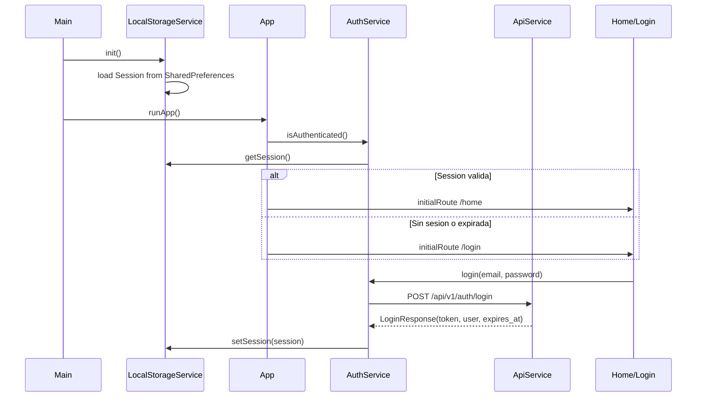
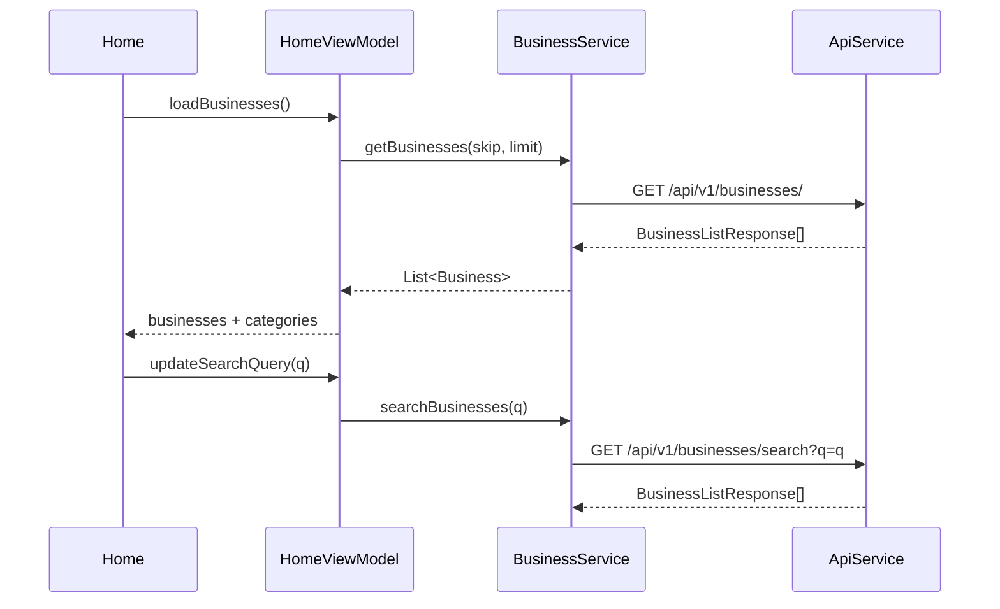

# UML

Diagrama actualizado para reflejar la arquitectura implementada actualmente en
CimaReviews: autenticacion con sesion persistente, consumo de API, Home con
busqueda/filtros, eventos, detalle de negocio, detalle de evento y permisos
basicos en el menu del negocio.

```mermaid
classDiagram
    direction TB

    %% ============================
    %% ENUMERACIONES
    %% ============================
    class Role {
        <<abstract>>
        +List~Permission~ permissions
        +hasPermission(Permission p) bool
    }

    class Admin {
    }

    class Moderator {
    }

    class Seller {
    }

    class UserRole {
    }

    class Permission {
        <<enumeration>>
        deleteAnyReview
        createBusiness
        editAnyBusiness
        deleteAnyBusiness
        banUser
        viewAnalytics
    }

    class Category {
        <<enumeration>>
        vegano
        cafeteria
        asiatica
        ramen
        mexicana
        desayunos
        panaderia
        sushi
        pizza
        hamburguesas
        tacos
        italiana
        ensaladas
        postres
    }

    class ReportStatus {
        <<enumeration>>
        PENDING
        REVIEWED
        RESOLVED
        REJECTED
    }

    %% ============================
    %% MODELOS
    %% ============================
    class User {
        +String id
        +String name
        +String email
        +Role role
        +List~Role~ roles
        +DateTime? createdAt
        +User.fromJson(Map json)
        +toJson() Map
    }

    class Session {
        +String token
        +User user
        +DateTime expiresAt
        +Session.fromJson(Map json)
        +isValid() bool
        +toJson() Map
    }

    class Business {
        +String id
        +String name
        +User owner
        +LatLng location
        +double avgRating
        +List~Product~ products
        +List~Review~ reviews
        +List~Category~ categories
        +String? description
        +String? imageUrl
        +Business.fromJson(Map json)
    }

    class Product {
        +String name
        +double price
        +String? description
        +Product.fromJson(Map json)
    }

    class Review {
        +String id
        +String? businessId
        +String? userId
        +double rating
        +String comment
        +User author
        +List~String~ images
        +DateTime? createdAt
        +Review.fromJson(Map json)
    }

    class Event {
        +String id
        +String title
        +String description
        +DateTime date
        +List~String~ businessIds
        +String imageUrl
        +List~Business~ participants
        +Event.fromJson(Map json)
    }

    class Report {
        +String id
        +String reason
        +String reporterId
        +String reportedUserId
        +String? businessId
        +String? reviewId
        +ReportStatus status
        +DateTime createdAt
    }

    %% ============================
    %% SERVICIOS DE INFRAESTRUCTURA
    %% ============================
    class ApiTransport {
        <<platform adapter>>
        +sendJsonRequest(Uri uri, String method, Map headers, Object? body) Future_ApiTransportResponse
    }

    class ApiTransportResponse {
        +int statusCode
        +String body
    }

    class ApiException {
        +String message
        +int? statusCode
        +Object? details
    }

    class ApiService {
        -String _baseUrl
        -String? _token
        +setToken(String token) void
        +clearToken() void
        +get(String endpoint, Map? queryParameters) Future~dynamic~
        +post(String endpoint, Object? body) Future~dynamic~
        +put(String endpoint, Object? body) Future~dynamic~
        +patch(String endpoint, Object? body) Future~dynamic~
        +delete(String endpoint) Future~void~
        -_buildHeaders() Map
        -_handleResponse(ApiTransportResponse response) dynamic
    }

    class LocalStorageService {
        <<singleton>>
        -SharedPreferences? _prefs
        -Session? _session
        -User? _user
        -String? _token
        +init() Future~void~
        +setToken(String token) Future~void~
        +getToken() String?
        +setUser(User user) Future~void~
        +getUser() User?
        +setSession(Session session) Future~void~
        +getSession() Session?
        +clear() Future~void~
        +clearAuthData() Future~void~
        -_loadSession() Future~void~
    }

    %% ============================
    %% SERVICIOS DE DOMINIO/API
    %% ============================
    class AuthService {
        -ApiService _api
        -LocalStorageService _storage
        +login(String email, String password) Future~Session~
        +register(String name, String email, String password) Future~User~
        +logout() Future~void~
        +refreshToken(String refreshToken) Future~Session~
        +changePassword(String oldPassword, String newPassword) Future~void~
        +forgotPassword(String email) Future~void~
        +isAuthenticated() bool
        +getCurrentSession() Session?
        -_saveSession(Session session) Future~void~
    }

    class BusinessService {
        -ApiService _api
        +getBusinesses(int skip, int limit) Future_List_Business
        +searchBusinesses(String query) Future_List_Business
        +getBusiness(String id) Future~Business~
        -_parseBusinessList(dynamic data) List~Business~
    }

    class EventService {
        -ApiService _api
        +getEvents(int skip, int limit) Future_List_Event
    }

    %% Repositorios legacy usados como fallback/demo en pantallas secundarias.
    class BusinessRepository {
        <<legacy singleton>>
        +List~Business~ businesses
        +getBusinesses() List~Business~
        +getBusiness(String id) Business
        +createBusiness(Business b) void
        +deleteBusiness(String id) void
    }

    class EventRepository {
        <<legacy>>
        +List~Event~ events
        +getEvents() List~Event~
    }

    %% ============================
    %% VIEWMODELS
    %% ============================
    class LoginViewModel {
        -AuthService _authService
        +String email
        +String password
        +bool isLoading
        +bool rememberMe
        +String? errorMessage
        +login() Future~bool~
        +loginWithBiometrics() Future~bool~
        +validateForm() bool
        +clearError() void
    }

    class RegisterUserViewModel {
        -AuthService _authService
        +String name
        +String email
        +String password
        +String confirmPassword
        +bool seller
        +bool isLoading
        +List~String~ errors
        +register() Future~bool~
        +validateForm() List~String~
    }

    class HomeViewModel {
        -BusinessService _businessService
        -List~Business~ _allBusinesses
        -List~Business~ _searchResults
        +bool isLoading
        +bool isSearching
        +String? error
        +String searchQuery
        +Category? selectedCategory
        +businesses List~Business~
        +categories List~Category~
        +loadBusinesses() Future~void~
        +selectCategory(Category? category) void
        +updateSearchQuery(String value) void
        +clearSearch() void
    }

    class BusinessDetailsViewModel {
        -BusinessService _businessService
        +Business business
        +bool isLoading
        +String? error
        +loadDetails() Future~void~
    }

    class EventsViewModel {
        -EventService _eventService
        +List~Event~ events
        +bool isLoading
        +String? error
        +loadEvents() Future~void~
        +refresh() Future~void~
    }

    class UserProfileViewModel {
        -AuthService _authService
        +User? user
        +bool isLoading
        +String? error
        +loadCurrentUser() void
        +displayName String
        +displayRole String
    }

    %% ============================
    %% VISTAS
    %% ============================
    class App {
        +String? initialRoute
        +build(BuildContext context) Widget
    }

    class LoginView {
        -LoginViewModel _viewModel
        -TextEditingController _emailController
        -TextEditingController _passwordController
        -_submit() Future~void~
    }

    class RegisterUserView {
        -RegisterUserViewModel _viewModel
        -TextEditingController _nameController
        -TextEditingController _emailController
        -TextEditingController _passwordController
        -TextEditingController _confirmPasswordController
        -_submit() Future~void~
    }

    class HomeView {
        -HomeViewModel _viewModel
        -TextEditingController _searchController
        -_buildBody(BuildContext context, List~Business~ businesses) Widget
    }

    class BusinessDetailsView {
        +Business business
        -BusinessDetailsViewModel _viewModel
    }

    class EventsView {
        -EventsViewModel _viewModel
        -_buildBody() Widget
    }

    class EventDetailsView {
        +Event? event
        -BusinessService _businessService
        -List~Business~ _businesses
        -bool _isLoading
        -String? _error
        -_loadBusinesses() Future~void~
    }

    class UserProfileView {
        -UserProfileViewModel _viewModel
        -AuthService _authService
        -bool _isLoggingOut
        -_logout() Future~void~
    }

    class BusinessMenuView {
        +Business? routeArgument
        +build(BuildContext context) Widget
        -isOwner bool
    }

    class CimaNavigationScaffold {
        +int currentIndex
        +Widget child
        +Widget? floatingActionButton
    }

    %% ============================
    %% RELACIONES DE MODELOS
    %% ============================
    Role <|-- Admin
    Role <|-- Moderator
    Role <|-- Seller
    Role <|-- UserRole

    User "1" *-- "many" Role : roles
    Session "1" --> "1" User : user
    Business "1" --> "1" User : owner
    Business "1" *-- "many" Product : products
    Business "1" *-- "many" Review : reviews
    Business "1" *-- "many" Category : categories
    Review "1" --> "1" User : author
    Event "1" --> "many" Business : participants preview
    Event "1" --> "many" Business : businessIds

    %% ============================
    %% RELACIONES DE SERVICIOS
    %% ============================
    ApiService --> ApiTransport : sends requests
    ApiService --> ApiTransportResponse : handles
    ApiService ..> ApiException : throws

    LocalStorageService --> Session : persists
    LocalStorageService --> User : persists

    AuthService --> ApiService : uses
    AuthService --> LocalStorageService : persists session
    AuthService --> Session : creates/reads

    BusinessService --> ApiService : uses
    BusinessService --> Business : maps JSON

    EventService --> ApiService : uses
    EventService --> Event : maps JSON

    BusinessRepository --> Business : legacy data
    EventRepository --> Event : legacy data

    %% ============================
    %% RELACIONES VIEWMODEL -> SERVICIO
    %% ============================
    LoginViewModel --> AuthService : login/register state
    RegisterUserViewModel --> AuthService : register
    HomeViewModel --> BusinessService : list/search/filter
    BusinessDetailsViewModel --> BusinessService : load full detail
    EventsViewModel --> EventService : list events
    UserProfileViewModel --> AuthService : current session

    %% ============================
    %% RELACIONES VIEW -> VIEWMODEL/SERVICIO
    %% ============================
    App --> AuthService : initialRoute auth check
    LoginView --> LoginViewModel : owns
    RegisterUserView --> RegisterUserViewModel : owns
    HomeView --> HomeViewModel : owns
    BusinessDetailsView --> BusinessDetailsViewModel : owns
    EventsView --> EventsViewModel : owns
    EventDetailsView --> BusinessService : loads participant businesses
    UserProfileView --> UserProfileViewModel : owns
    UserProfileView --> AuthService : logout
    BusinessMenuView --> AuthService : checks current user
    BusinessMenuView --> BusinessRepository : fallback only

    HomeView ..> BusinessDetailsView : opens selected business
    EventsView ..> EventDetailsView : opens selected event
    EventDetailsView ..> BusinessDetailsView : opens participant business
    BusinessDetailsView ..> BusinessMenuView : opens business menu with Business argument
    UserProfileView ..> LoginView : logout redirects
    HomeView --> CimaNavigationScaffold : wrapped by
    EventsView --> CimaNavigationScaffold : wrapped by
    UserProfileView --> CimaNavigationScaffold : wrapped by
```



## Flujos principales





```mermaid
sequenceDiagram
    participant Details as BusinessDetailsView
    participant VM as BusinessDetailsViewModel
    participant BusinessSvc as BusinessService
    participant Menu as BusinessMenuView
    participant Auth as AuthService

    Details->>VM: loadDetails()
    VM->>BusinessSvc: getBusiness(business.id)
    BusinessSvc-->>VM: BusinessDetailResponse
    Details->>Menu: open with Business argument
    Menu->>Auth: getCurrentSession()
    alt currentUser.id == business.owner.id
        Menu-->>Menu: show add product/category actions
    else Cliente o no duenio
        Menu-->>Menu: hide owner-only actions
    end
```
