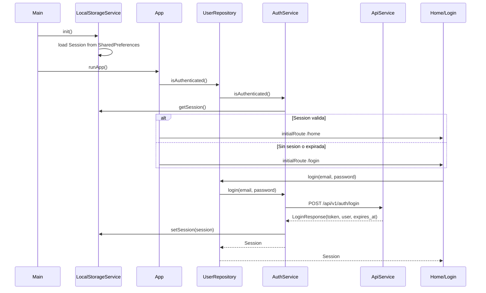
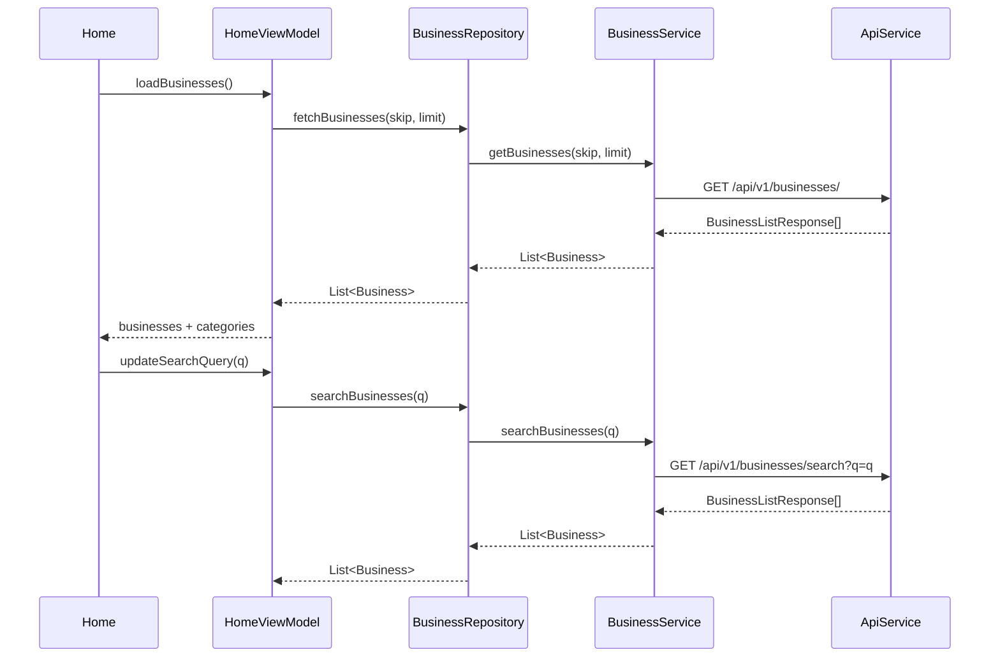
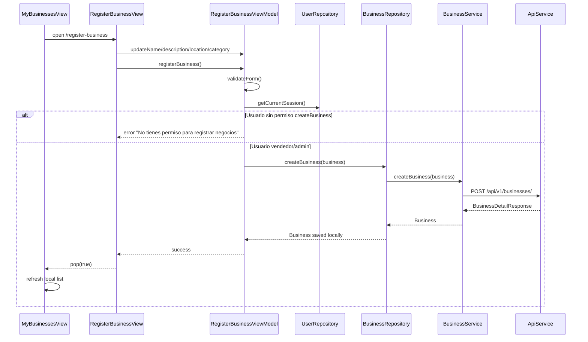

# UML

Diagrama actualizado para reflejar la arquitectura MVVM implementada actualmente
en CimaReviews: las vistas consumen ViewModels, los ViewModels dependen de
repositorios, y los repositorios encapsulan los servicios/API. Incluye
autenticacion con sesion persistente, consumo de API, Home con busqueda/filtros,
eventos, detalle de negocio, detalle de evento y permisos basicos en el menu del
negocio.

```mermaid
classDiagram
    direction TB

    %% ============================
    %% ENUMERACIONES
    %% ============================
    class Role {
        <<abstract>>
        +List~Permission~ permissions
        +hasPermission(Permission p) bool
    }

    class Admin {
    }

    class Moderator {
    }

    class Seller {
    }

    class UserRole {
    }

    class Permission {
        <<enumeration>>
        deleteAnyReview
        createBusiness
        editAnyBusiness
        deleteAnyBusiness
        banUser
        viewAnalytics
    }

    class Category {
        <<enumeration>>
        vegano
        cafeteria
        asiatica
        ramen
        mexicana
        desayunos
        panaderia
        sushi
        pizza
        hamburguesas
        tacos
        italiana
        ensaladas
        postres
    }

    class ReportStatus {
        <<enumeration>>
        PENDING
        REVIEWED
        RESOLVED
        REJECTED
    }

    %% ============================
    %% MODELOS
    %% ============================
    class User {
        +String id
        +String name
        +String email
        +Role role
        +List~Role~ roles
        +DateTime? createdAt
        +User.fromJson(Map json)
        +toJson() Map
    }

    class Session {
        +String token
        +User user
        +DateTime expiresAt
        +Session.fromJson(Map json)
        +isValid() bool
        +toJson() Map
    }

    class Business {
        +String id
        +String name
        +User owner
        +LatLng location
        +double avgRating
        +List~Product~ products
        +List~Review~ reviews
        +List~Category~ categories
        +String? description
        +String? imageUrl
        +Business.fromJson(Map json)
    }

    class Product {
        +String name
        +double price
        +String? description
        +Product.fromJson(Map json)
        +toJson() Map
    }

    class Review {
        +String id
        +String? businessId
        +String? userId
        +double rating
        +String comment
        +User author
        +List~String~ images
        +DateTime? createdAt
        +Review.fromJson(Map json)
    }

    class Event {
        +String id
        +String title
        +String description
        +DateTime date
        +List~String~ businessIds
        +String imageUrl
        +List~Business~ participants
        +Event.fromJson(Map json)
    }

    class Report {
        +String id
        +String reason
        +String reporterId
        +String reportedUserId
        +String? businessId
        +String? reviewId
        +ReportStatus status
        +DateTime createdAt
    }

    %% ============================
    %% SERVICIOS DE INFRAESTRUCTURA
    %% ============================
    class ApiTransport {
        <<platform adapter>>
        +sendJsonRequest(Uri uri, String method, Map headers, Object? body) Future_ApiTransportResponse
    }

    class ApiTransportResponse {
        +int statusCode
        +String body
    }

    class ApiException {
        +String message
        +int? statusCode
        +Object? details
    }

    class ApiService {
        -String _baseUrl
        -String? _token
        +setToken(String token) void
        +clearToken() void
        +get(String endpoint, Map? queryParameters) Future~dynamic~
        +post(String endpoint, Object? body) Future~dynamic~
        +put(String endpoint, Object? body) Future~dynamic~
        +patch(String endpoint, Object? body) Future~dynamic~
        +delete(String endpoint) Future~void~
        -_buildHeaders() Map
        -_handleResponse(ApiTransportResponse response) dynamic
    }

    class LocalStorageService {
        <<singleton>>
        -SharedPreferences? _prefs
        -Session? _session
        -User? _user
        -String? _token
        +init() Future~void~
        +setToken(String token) Future~void~
        +getToken() String?
        +setUser(User user) Future~void~
        +getUser() User?
        +setSession(Session session) Future~void~
        +getSession() Session?
        +clear() Future~void~
        +clearAuthData() Future~void~
        -_loadSession() Future~void~
    }

    %% ============================
    %% SERVICIOS DE DOMINIO/API
    %% ============================
    class AuthService {
        -ApiService _api
        -LocalStorageService _storage
        +login(String email, String password) Future~Session~
        +register(String name, String email, String password) Future~User~
        +logout() Future~void~
        +refreshToken(String refreshToken) Future~Session~
        +changePassword(String oldPassword, String newPassword) Future~void~
        +forgotPassword(String email) Future~void~
        +isAuthenticated() bool
        +getCurrentSession() Session?
        -_saveSession(Session session) Future~void~
    }

    class BusinessService {
        -ApiService _api
        +getBusinesses(int skip, int limit) Future_List_Business
        +searchBusinesses(String query) Future_List_Business
        +getBusiness(String id) Future~Business~
        +createBusiness(Business business) Future~Business~
        +updateBusinessProducts(Business business, List~Product~ products) Future~Business~
        -_parseBusinessList(dynamic data) List~Business~
    }

    class ReviewService {
        -ApiService _api
        +createReview(Review review) Future~Review~
        +deleteReview(String id) Future~void~
    }

    class EventService {
        -ApiService _api
        +getEvents(int skip, int limit) Future_List_Event
    }

    %% ============================
    %% REPOSITORIOS
    %% ============================
    class BusinessRepository {
        <<singleton>>
        -BusinessService _service
        +fetchBusinesses(int skip, int limit) Future_List_Business
        +searchBusinesses(String query) Future_List_Business
        +fetchBusiness(String id) Future_Business
        +getLocalBusinesses() List~Business~
        +getLocalBusiness(String id) Business
        +createBusiness(Business b) Future~Business~
        +addProduct(String businessId, Product product) Future~Business~
        +deleteBusiness(String id) void
    }

    class EventRepository {
        -EventService _service
        +fetchEvents(int skip, int limit) Future_List_Event
        +getLocalEvents() List~Event~
    }

    class UserRepository {
        -AuthService _authService
        +login(String email, String password) Future_Session
        +register(String name, String email, String password) Future_User
        +logout() Future_void
        +isAuthenticated() bool
        +getCurrentSession() Session?
    }

    class ReviewRepository {
        -ReviewService _service
        -BusinessRepository _businessRepository
        +createReview(Review r, String userId) bool
        +submitReview(Review review) Future~Review~
        +deleteReview(String id, String userId, bool canDeleteAny) Future~bool~
        +hasReviewForBusiness(String businessId, String userId) bool
    }

    %% ============================
    %% VIEWMODELS
    %% ============================
    class LoginViewModel {
        -UserRepository _userRepository
        +String email
        +String password
        +bool isLoading
        +bool rememberMe
        +String? errorMessage
        +login() Future~bool~
        +loginWithBiometrics() Future~bool~
        +validateForm() bool
        +clearError() void
    }

    class RegisterUserViewModel {
        -UserRepository _userRepository
        +String name
        +String email
        +String password
        +String confirmPassword
        +bool seller
        +bool isLoading
        +List~String~ errors
        +register() Future~bool~
        +validateForm() List~String~
    }

    class RegisterBusinessViewModel {
        -BusinessRepository _businessRepository
        -UserRepository _userRepository
        +String name
        +String description
        +String latitude
        +String longitude
        +String imageUrl
        +Category? selectedCategory
        +bool isLoading
        +List~String~ errors
        +Business? createdBusiness
        +selectCategory(Category? value) void
        +validateForm() List~String~
        +registerBusiness() Future~bool~
    }

    class HomeViewModel {
        -BusinessRepository _businessRepository
        -List~Business~ _allBusinesses
        -List~Business~ _searchResults
        +bool isLoading
        +bool isSearching
        +String? error
        +String searchQuery
        +Category? selectedCategory
        +businesses List~Business~
        +categories List~Category~
        +loadBusinesses() Future~void~
        +selectCategory(Category? category) void
        +updateSearchQuery(String value) void
        +clearSearch() void
    }

    class BusinessDetailsViewModel {
        -BusinessRepository _businessRepository
        -ReviewRepository _reviewRepository
        -UserRepository _userRepository
        +Business business
        +bool isLoading
        +String? deletingReviewId
        +String? error
        +loadDetails() Future~void~
        +canDeleteReview(Review review) bool
        +deleteReview(Review review) Future~bool~
    }

    class WriteReviewViewModel {
        -ReviewRepository _reviewRepository
        -UserRepository _userRepository
        +Business business
        +int rating
        +String comment
        +bool isLoading
        +String? errorMessage
        +canSubmit bool
        +setRating(int value) void
        +updateComment(String value) void
        +validateForm() bool
        +submitReview() Future~bool~
    }

    class EventsViewModel {
        -EventRepository _eventRepository
        +List~Event~ events
        +bool isLoading
        +String? error
        +loadEvents() Future~void~
        +refresh() Future~void~
    }

    class UserProfileViewModel {
        -UserRepository _userRepository
        +User? user
        +bool isLoading
        +String? error
        +loadCurrentUser() void
        +logout() Future_void
        +displayName String
        +displayRole String
    }

    class EventDetailsViewModel {
        -BusinessRepository _businessRepository
        +Event? event
        +List~Business~ businesses
        +bool isLoading
        +String? error
        +hasBusinessIds bool
        +loadBusinesses() Future_void
    }

    class BusinessMenuViewModel {
        -UserRepository _userRepository
        +Business business
        +currentUser User?
        +isOwner bool
    }

    class AddProductViewModel {
        -BusinessRepository _businessRepository
        -UserRepository _userRepository
        +Business business
        +String name
        +String price
        +String description
        +bool isLoading
        +List~String~ errors
        +Product? createdProduct
        +validateForm() List~String~
        +addProduct() Future~bool~
    }

    %% ============================
    %% VISTAS
    %% ============================
    class App {
        +String? initialRoute
        +build(BuildContext context) Widget
    }

    class LoginView {
        -LoginViewModel _viewModel
        -TextEditingController _emailController
        -TextEditingController _passwordController
        -_submit() Future~void~
    }

    class RegisterUserView {
        -RegisterUserViewModel _viewModel
        -TextEditingController _nameController
        -TextEditingController _emailController
        -TextEditingController _passwordController
        -TextEditingController _confirmPasswordController
        -_submit() Future~void~
    }

    class RegisterBusinessView {
        -RegisterBusinessViewModel _viewModel
        -TextEditingController _nameController
        -TextEditingController _descriptionController
        -TextEditingController _latitudeController
        -TextEditingController _longitudeController
        -TextEditingController _imageUrlController
        -_submit() Future~void~
    }

    class HomeView {
        -HomeViewModel _viewModel
        -TextEditingController _searchController
        -_buildBody(BuildContext context, List~Business~ businesses) Widget
    }

    class BusinessDetailsView {
        +Business business
        -BusinessDetailsViewModel _viewModel
    }

    class WriteReviewView {
        -WriteReviewViewModel _viewModel
        -TextEditingController _commentController
        -_submit() Future~void~
    }

    class EventsView {
        -EventsViewModel _viewModel
        -_buildBody() Widget
    }

    class EventDetailsView {
        +Event? event
        -EventDetailsViewModel _viewModel
    }

    class UserProfileView {
        -UserProfileViewModel _viewModel
        -bool _isLoggingOut
        -_logout() Future~void~
    }

    class BusinessMenuView {
        +Business? routeArgument
        -BusinessMenuViewModel _viewModel
        +build(BuildContext context) Widget
    }

    class AddProductView {
        +Business? routeArgument
        -AddProductViewModel _viewModel
        -TextEditingController _nameController
        -TextEditingController _priceController
        -TextEditingController _descriptionController
        -_submit() Future~void~
    }

    class CimaNavigationScaffold {
        +int currentIndex
        +Widget child
        +Widget? floatingActionButton
    }

    %% ============================
    %% RELACIONES DE MODELOS
    %% ============================
    Role <|-- Admin
    Role <|-- Moderator
    Role <|-- Seller
    Role <|-- UserRole

    User "1" *-- "many" Role : roles
    Session "1" --> "1" User : user
    Business "1" --> "1" User : owner
    Business "1" *-- "many" Product : products
    Business "1" *-- "many" Review : reviews
    Business "1" *-- "many" Category : categories
    Review "1" --> "1" User : author
    Event "1" --> "many" Business : participants preview
    Event "1" --> "many" Business : businessIds

    %% ============================
    %% RELACIONES DE SERVICIOS
    %% ============================
    ApiService --> ApiTransport : sends requests
    ApiService --> ApiTransportResponse : handles
    ApiService ..> ApiException : throws

    LocalStorageService --> Session : persists
    LocalStorageService --> User : persists

    AuthService --> ApiService : uses
    AuthService --> LocalStorageService : persists session
    AuthService --> Session : creates/reads

    BusinessService --> ApiService : uses
    BusinessService --> Business : maps JSON

    ReviewService --> ApiService : uses
    ReviewService --> Review : maps JSON

    EventService --> ApiService : uses
    EventService --> Event : maps JSON

    BusinessRepository --> BusinessService : wraps API access
    BusinessRepository --> Business : local fallback data
    ReviewRepository --> ReviewService : wraps API access
    ReviewRepository --> BusinessRepository : updates local business reviews
    ReviewRepository --> Review : creates/deletes
    EventRepository --> EventService : wraps API access
    EventRepository --> Event : local fallback data
    UserRepository --> AuthService : wraps auth/session

    %% ============================
    %% RELACIONES VIEWMODEL -> REPOSITORIO
    %% ============================
    LoginViewModel --> UserRepository : login state
    RegisterUserViewModel --> UserRepository : register state
    RegisterBusinessViewModel --> BusinessRepository : create business
    RegisterBusinessViewModel --> UserRepository : current owner/permission
    HomeViewModel --> BusinessRepository : list/search/filter
    BusinessDetailsViewModel --> BusinessRepository : load full detail
    BusinessDetailsViewModel --> ReviewRepository : delete review
    BusinessDetailsViewModel --> UserRepository : current user permissions
    WriteReviewViewModel --> ReviewRepository : submit review
    WriteReviewViewModel --> UserRepository : current author
    EventsViewModel --> EventRepository : list events
    EventDetailsViewModel --> BusinessRepository : participant previews
    BusinessMenuViewModel --> UserRepository : owner permissions
    UserProfileViewModel --> UserRepository : current session/logout
    AddProductViewModel --> BusinessRepository : update product list
    AddProductViewModel --> UserRepository : current owner permission

    %% ============================
    %% RELACIONES VIEW -> VIEWMODEL/REPOSITORIO
    %% ============================
    App --> UserRepository : initialRoute auth check
    LoginView --> LoginViewModel : owns
    RegisterUserView --> RegisterUserViewModel : owns
    RegisterBusinessView --> RegisterBusinessViewModel : owns
    HomeView --> HomeViewModel : owns
    BusinessDetailsView --> BusinessDetailsViewModel : owns
    WriteReviewView --> WriteReviewViewModel : owns
    EventsView --> EventsViewModel : owns
    EventDetailsView --> EventDetailsViewModel : owns
    UserProfileView --> UserProfileViewModel : owns
    BusinessMenuView --> BusinessMenuViewModel : owns
    BusinessMenuView --> BusinessRepository : fallback business
    AddProductView --> AddProductViewModel : owns

    HomeView ..> BusinessDetailsView : opens selected business
    EventsView ..> EventDetailsView : opens selected event
    EventDetailsView ..> BusinessDetailsView : opens participant business
    BusinessDetailsView ..> BusinessMenuView : opens business menu with Business argument
    BusinessDetailsView ..> WriteReviewView : opens with Business argument
    BusinessMenuView ..> AddProductView : opens with Business argument
    UserProfileView ..> LoginView : logout redirects
    HomeView --> CimaNavigationScaffold : wrapped by
    EventsView --> CimaNavigationScaffold : wrapped by
    UserProfileView --> CimaNavigationScaffold : wrapped by
```

## Flujos principales







```mermaid
sequenceDiagram
    participant Details as BusinessDetailsView
    participant VM as BusinessDetailsViewModel
    participant BusinessRepo as BusinessRepository
    participant BusinessSvc as BusinessService
    participant ReviewRepo as ReviewRepository
    participant ReviewSvc as ReviewService
    participant Api as ApiService
    participant Menu as BusinessMenuView
    participant MenuVM as BusinessMenuViewModel
    participant AddProduct as AddProductView
    participant ProductVM as AddProductViewModel
    participant UserRepo as UserRepository

    Details->>VM: loadDetails()
    VM->>BusinessRepo: fetchBusiness(business.id)
    BusinessRepo->>BusinessSvc: getBusiness(business.id)
    BusinessSvc-->>BusinessRepo: BusinessDetailResponse
    BusinessRepo-->>VM: Business
    Details->>VM: canDeleteReview(review)
    alt Autor de la resena o permiso deleteAnyReview
        Details->>Details: show delete action
        Details->>VM: deleteReview(review)
        VM->>ReviewRepo: deleteReview(review.id, user.id, canDeleteAny)
        ReviewRepo->>ReviewSvc: deleteReview(review.id)
        ReviewSvc->>Api: DELETE /api/v1/reviews/{review_id}
        Api-->>ReviewSvc: 204 No Content
        ReviewRepo-->>VM: true + local reviews updated
        VM-->>Details: reviews without deleted item
    else Sin permiso
        Details->>Details: hide delete action
    end
    Details->>Menu: open with Business argument
    Menu->>MenuVM: isOwner
    MenuVM->>UserRepo: getCurrentSession()
    alt currentUser.id == business.owner.id
        Menu-->>Menu: show add product/category actions
        Menu->>AddProduct: open with Business argument
        AddProduct->>ProductVM: updateName/price/description
        AddProduct->>ProductVM: addProduct()
        ProductVM->>UserRepo: getCurrentSession()
        ProductVM->>BusinessRepo: addProduct(business.id, product)
        BusinessRepo->>BusinessSvc: updateBusinessProducts(business, products + product)
        BusinessSvc->>Api: PUT /api/v1/businesses/{business_id}
        Api-->>BusinessSvc: BusinessDetailResponse
        BusinessSvc-->>BusinessRepo: Business
        BusinessRepo-->>ProductVM: Business with new product
        ProductVM-->>AddProduct: success
        AddProduct-->>Menu: pop(true)
        Menu->>Menu: refresh product list
    else Cliente o no duenio
        Menu-->>Menu: hide owner-only actions
    end
```

```mermaid
sequenceDiagram
    participant Details as BusinessDetailsView
    participant Write as WriteReviewView
    participant VM as WriteReviewViewModel
    participant UserRepo as UserRepository
    participant ReviewRepo as ReviewRepository
    participant ReviewSvc as ReviewService
    participant Api as ApiService
    participant BusinessRepo as BusinessRepository

    Details->>Write: open with Business argument
    Write->>VM: setRating(value), updateComment(text)
    Write->>VM: submitReview()
    VM->>VM: validateForm()
    VM->>UserRepo: getCurrentSession()
    VM->>ReviewRepo: hasReviewForBusiness(business.id, user.id)
    alt Usuario ya escribio resena para ese negocio
        VM-->>Write: error "Ya escribiste una resena para este negocio"
    else Sin resena previa
    VM->>ReviewRepo: submitReview(review)
    ReviewRepo->>ReviewSvc: createReview(review)
    ReviewSvc->>Api: POST /api/v1/reviews/
    Api-->>ReviewSvc: ReviewResponse
    ReviewSvc-->>ReviewRepo: Review
    ReviewRepo->>BusinessRepo: update local business reviews
    ReviewRepo-->>VM: Review
    VM-->>Write: success
    Write-->>Details: pop(true)
    end
```

```mermaid
sequenceDiagram
    participant Events as EventsView
    participant EventsVM as EventsViewModel
    participant EventRepo as EventRepository
    participant EventSvc as EventService
    participant Api as ApiService
    participant Details as EventDetailsView
    participant DetailsVM as EventDetailsViewModel
    participant BusinessRepo as BusinessRepository
    participant BusinessSvc as BusinessService

    Events->>EventsVM: loadEvents()
    EventsVM->>EventRepo: fetchEvents(skip, limit)
    EventRepo->>EventSvc: getEvents(skip, limit)
    EventSvc->>Api: GET /api/v1/events/
    Api-->>EventSvc: EventResponse[]
    EventSvc-->>EventRepo: List<Event>
    EventRepo-->>EventsVM: List<Event>

    Events->>Details: open selected event
    Details->>DetailsVM: loadBusinesses()
    loop businessIds
        DetailsVM->>BusinessRepo: fetchBusiness(id)
        BusinessRepo->>BusinessSvc: getBusiness(id)
        BusinessSvc-->>BusinessRepo: BusinessDetailResponse
        BusinessRepo-->>DetailsVM: Business
    end
    DetailsVM-->>Details: participant businesses
```
